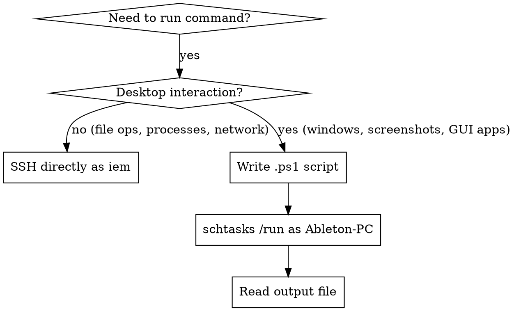

# iem.lan Remote Desktop Control

## Overview

Control the iem.lan Windows desktop remotely via SSH + scheduled tasks. The SSH user (`iem`) cannot see or interact with desktop apps directly - all desktop operations must run as the logged-in desktop user (`Ableton-PC`) via `schtasks`.

## User Model (CRITICAL)

| User         | Purpose                   | Can See Desktop? |
| ------------ | ------------------------- | ---------------- |
| `iem`        | SSH access only           | NO               |
| `Ableton-PC` | Logged-in desktop session | YES              |

**The #1 mistake:** Running desktop commands as `iem` user. They will silently fail or produce empty results.



## SSH Connection

```bash
sshpass -p 'iem' ssh -o StrictHostKeyChecking=no iem@iem.lan "command"
```

| Property     | Value                      |
| ------------ | -------------------------- |
| Host         | `iem.lan`                  |
| User         | `iem`                      |
| Password     | `iem`                      |
| Desktop user | `Ableton-PC` (no password) |

## Running Commands as Desktop User

### The Pattern (use EVERY TIME for desktop operations)

```bash
# 1. Write PowerShell script to iem.lan
cat << 'EOF' | sshpass -p 'iem' ssh -o StrictHostKeyChecking=no iem@iem.lan \
  "powershell -Command \"\$input | Set-Content C:\\Users\\iem\\agent-script.ps1\""
# Your PowerShell code here
"result" | Out-File C:\Users\iem\agent-output.txt -Encoding UTF8
EOF

# 2. Create and run scheduled task as desktop user
sshpass -p 'iem' ssh -o StrictHostKeyChecking=no iem@iem.lan \
  "schtasks /create /tn \"agent-cmd\" /tr \"powershell -ExecutionPolicy Bypass -File C:\Users\iem\agent-script.ps1\" /sc once /st 00:00 /ru Ableton-PC /it /f /rl highest 2>nul && schtasks /run /tn \"agent-cmd\" 2>nul"

# 3. Wait for completion
sleep 3

# 4. Read output
sshpass -p 'iem' ssh -o StrictHostKeyChecking=no iem@iem.lan \
  "type C:\Users\iem\agent-output.txt"
```

### schtasks Flags Explained

| Flag             | Value              | Why                                    |
| ---------------- | ------------------ | -------------------------------------- |
| `/tn`            | `"agent-cmd"`      | Task name (reused each time with `/f`) |
| `/tr`            | `"powershell ..."` | Command to run                         |
| `/sc once`       | one-time           | We trigger manually with `/run`        |
| `/st 00:00`      | midnight           | Required but ignored (we use `/run`)   |
| `/ru Ableton-PC` | desktop user       | Run in desktop session                 |
| `/it`            | interactive        | Must see desktop windows               |
| `/f`             | force              | Overwrite existing task                |
| `/rl highest`    | elevated           | Admin privileges                       |

### NEVER Do This

```bash
# WRONG: iem user can't see desktop windows
sshpass -p 'iem' ssh iem@iem.lan "powershell Get-Process | Where MainWindowTitle"
# Returns EMPTY - iem has no desktop session!

# WRONG: Starting GUI app as iem - invisible, no desktop
sshpass -p 'iem' ssh iem@iem.lan "start notepad"
# Process starts but has no visible window!
```

## Quick Reference

### List Visible Windows

```powershell
# In agent-script.ps1:
Get-Process | Where-Object { $_.MainWindowTitle -ne '' } |
  ForEach-Object { "PID=$($_.Id) HWND=$($_.MainWindowHandle) TITLE=$($_.MainWindowTitle)" } |
  Out-File C:\Users\iem\agent-output.txt -Encoding UTF8
```

### Take Screenshot (Full Desktop)

```powershell
Add-Type -AssemblyName System.Windows.Forms
Add-Type -AssemblyName System.Drawing
$screen = [System.Windows.Forms.Screen]::PrimaryScreen.Bounds
$bitmap = New-Object System.Drawing.Bitmap($screen.Width, $screen.Height)
$graphics = [System.Drawing.Graphics]::FromImage($bitmap)
$graphics.CopyFromScreen($screen.Location, [System.Drawing.Point]::Empty, $screen.Size)
$bitmap.Save("C:\Users\iem\screenshot.png", [System.Drawing.Imaging.ImageFormat]::Png)
$graphics.Dispose()
$bitmap.Dispose()
```

Then download and view:

```bash
sshpass -p 'iem' scp -o StrictHostKeyChecking=no iem@iem.lan:screenshot.png /tmp/iem_screenshot.png
# Use Read tool on /tmp/iem_screenshot.png to analyze visually
```

### Take Screenshot (Specific Window)

```powershell
Add-Type -AssemblyName System.Windows.Forms
Add-Type -AssemblyName System.Drawing
Add-Type @"
using System;
using System.Runtime.InteropServices;
public class WinCapture {
    [DllImport("user32.dll")]
    public static extern bool GetWindowRect(IntPtr hWnd, out RECT lpRect);
    [DllImport("user32.dll")]
    public static extern bool SetForegroundWindow(IntPtr hWnd);
    [StructLayout(LayoutKind.Sequential)]
    public struct RECT { public int Left, Top, Right, Bottom; }
}
"@

$proc = Get-Process -Name "TARGET_PROCESS" | Select-Object -First 1
[WinCapture]::SetForegroundWindow($proc.MainWindowHandle)
Start-Sleep -Milliseconds 500
$rect = New-Object WinCapture+RECT
[WinCapture]::GetWindowRect($proc.MainWindowHandle, [ref]$rect)
$w = $rect.Right - $rect.Left; $h = $rect.Bottom - $rect.Top
$bmp = New-Object System.Drawing.Bitmap($w, $h)
$g = [System.Drawing.Graphics]::FromImage($bmp)
$g.CopyFromScreen($rect.Left, $rect.Top, 0, 0, (New-Object System.Drawing.Size($w, $h)))
$bmp.Save("C:\Users\iem\screenshot.png", [System.Drawing.Imaging.ImageFormat]::Png)
$g.Dispose(); $bmp.Dispose()
```

### Window Manipulation

```powershell
# Required WinAPI declaration (include once per script)
Add-Type @"
using System;
using System.Runtime.InteropServices;
public class WinAPI {
    [DllImport("user32.dll")] public static extern bool ShowWindow(IntPtr hWnd, int nCmdShow);
    [DllImport("user32.dll")] public static extern bool SetForegroundWindow(IntPtr hWnd);
}
"@

$proc = Get-Process -Name "TARGET" | Where-Object { $_.MainWindowTitle -ne '' } | Select-Object -First 1

# Minimize
[WinAPI]::ShowWindow($proc.MainWindowHandle, 6)

# Maximize
[WinAPI]::ShowWindow($proc.MainWindowHandle, 3)

# Restore (from minimized/maximized)
[WinAPI]::ShowWindow($proc.MainWindowHandle, 9)

# Bring to front / Focus
[WinAPI]::SetForegroundWindow($proc.MainWindowHandle)
```

| ShowWindow constant | Value | Effect               |
| ------------------- | ----- | -------------------- |
| SW_HIDE             | 0     | Hide window          |
| SW_SHOW             | 5     | Show window          |
| SW_MINIMIZE         | 6     | Minimize             |
| SW_MAXIMIZE         | 3     | Maximize             |
| SW_RESTORE          | 9     | Restore from min/max |

### Launch Application

```powershell
Start-Process "C:\path\to\app.exe" -ArgumentList "args" -PassThru |
  ForEach-Object { "Launched PID=$($_.Id)" | Out-File C:\Users\iem\agent-output.txt }
```

### Close Application (Graceful then Force)

```powershell
$proc = Get-Process -Name "TARGET" -ErrorAction SilentlyContinue | Select-Object -First 1
if ($proc) {
    $proc.CloseMainWindow() | Out-Null  # Graceful close
    Start-Sleep -Seconds 2
    if (!$proc.HasExited) { $proc.Kill() }  # Force if needed
}
```

### Kill Process (Immediate - no save dialog)

```powershell
Stop-Process -Name "TARGET" -Force
```

## Process Names on iem.lan

| Process Name            | Application            |
| ----------------------- | ---------------------- |
| `VBAudioMatrix_x64`     | VB-Audio Matrix        |
| `audiotester`           | AudioTester (our app)  |
| `Ableton Live 11 Suite` | Ableton Live           |
| `rustdesk`              | RustDesk remote access |
| `Taskmgr`               | Task Manager           |

## Operations That DON'T Need Desktop User

These work fine directly via SSH as `iem`:

```bash
# File operations
sshpass -p 'iem' ssh iem@iem.lan "type C:\path\to\file.txt"
sshpass -p 'iem' ssh iem@iem.lan "dir C:\Users\iem\"

# Process listing (basic - no window titles)
sshpass -p 'iem' ssh iem@iem.lan "tasklist | findstr audiotester"

# Network operations
sshpass -p 'iem' ssh iem@iem.lan "netstat -an | findstr 8920"

# Service management
sshpass -p 'iem' ssh iem@iem.lan "sc query wuauserv"

# Killing processes (works from any user)
sshpass -p 'iem' ssh iem@iem.lan "taskkill /im notepad.exe /f"

# File copy
sshpass -p 'iem' scp iem@iem.lan:path/to/file.txt /tmp/local.txt
```

## Cleanup

**Always clean up the scheduled task after use:**

```bash
sshpass -p 'iem' ssh -o StrictHostKeyChecking=no iem@iem.lan \
  "schtasks /delete /tn \"agent-cmd\" /f 2>nul"
```

## Common Mistakes

| Mistake                                     | Fix                                                   |
| ------------------------------------------- | ----------------------------------------------------- |
| Running GUI commands as `iem` user          | Use schtasks pattern with `/ru Ableton-PC /it`        |
| Forgetting `/it` flag                       | Without it, task runs headless - no desktop access    |
| Not waiting after `/run`                    | `sleep 3-5` before reading output                     |
| Using `timeout /t` in SSH                   | Breaks SSH input - use separate commands with `sleep` |
| Checking window titles as `iem`             | Only desktop user session can enumerate windows       |
| Forgetting to clean up `agent-cmd` task     | Delete after each use to prevent stale tasks          |
| Not specifying `-Encoding UTF8` in Out-File | Output may be unreadable                              |
